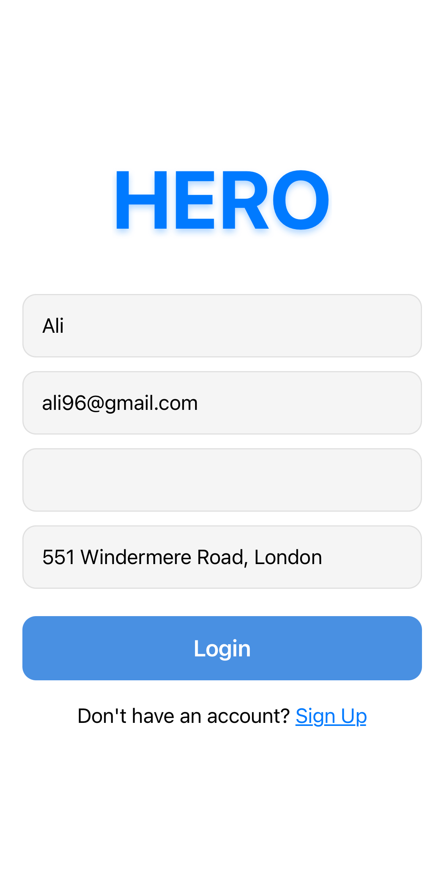

# HERO

**Engineering problem:** How can we keep transportation running in a flood or forest fire?

HERO is a mobile application designed to help communities coordinate aid and report obstacles during times of need. It allows help seekers to request rides and first aid to help evacuate people who don't have someone else to turn to. Built with React Native, it provides an intuitive interface for both giving and receiving assistance.

## Features

### Assistance Hub (Request Aid)

- **Identity Verification**: Secure ID verification for heroes
- **Community Board**: Real-time community chat for local updates
- **Request Ride**: Coordinate transportation assistance
- **Request First Aid**: Emergency medical assistance requests
- **Report Obstacles**: Mark and describe hazards on the map with crowdsourcing

### Give Aid (For Heroes)

- **Interactive Map**: View all reported obstacles and assistance requests
- **Real-time Navigation**: Get driving directions to first aid or ride requests
- **Route Options**: Multiple route suggestions avoiding reported obstacles

### Weather Map

- **Flood map**: Display flooded areas in community dependent on level of rain
- **Elevation:** Tap anywhere on the map to view the elevation at that location

## Screenshots

### User Flow

<div style="display: flex; flex-wrap: wrap; gap: 10px;">
  

  

### Hero Response Features

<div style="display: flex; flex-wrap: wrap; gap: 10px;">
  
  
  
</div>

### Assistance Request Features

<div style="display: flex; flex-wrap: wrap; gap: 10px;">
  
  
  
</div>

## How to run the app

### Prerequisites

- Node.js
- npm or yarn
- Expo CLI
- Expo Go app (for mobile testing)

### Installation

1. Clone the repository

```bash
git clone https://github.com/mmbaguette/HERO.git
```

2. Install dependencies

```bash
cd HERO
npm install
```

3. Set up configuration

```bash
# Copy the config template
cp config.template.js config.js

# Edit config.js with your values:
# - Server IP and URL
# - Google Maps API keys
# - Admin credentials
```

4. Start expo server for app testing

```bash
npx expo start
```

5. Scan the QR code with Expo Go app to run on your device
6. Start the local server

```bash
cd Hero\ Server
node server.js
```

### Configuration Setup

The app requires several configuration values that are kept secure and not committed to the repository. These are managed through a `config.js` file that you'll need to create based on the provided template.

1. Copy `config.template.js` to `config.js`
2. Fill in your values:
   ```javascript
   // config.js structure
   export const SERVER_IP = '...';       // Your local IP for development
   export const SERVER_URL = '...';      // WebSocket server URL
   export const GOOGLE_MAPS_CONFIG = {
     API_KEY: '...',            // Google Maps JavaScript API key
   };
   export const ADMIN_CREDENTIALS = {
     username: '...',           // Admin username
     password: '...'            // Admin password
   };

   export const STRIPE_CONFIG = {
     TEST_SECRET_KEY: 'YOUR_STRIPE_TEST_SECRET_KEY',
   }; 
   ```

Note: The actual `config.js` file is excluded from git via `.gitignore` to keep sensitive data secure.

## License

This project is private and proprietary. All rights reserved.

## Contact

Ali Mohammed-Ali - [@mmbaguette](https://github.com/mmbaguette)

Project Link: [https://github.com/mmbaguette/HERO](https://github.com/mmbaguette/HERO)
